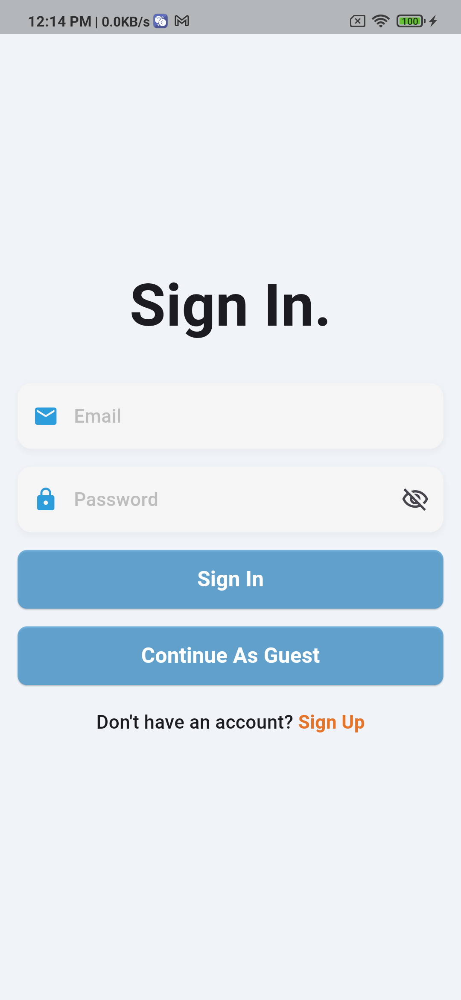
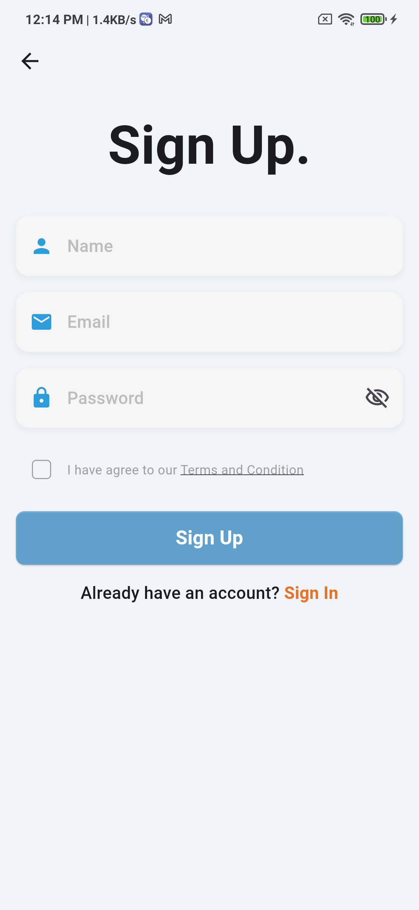
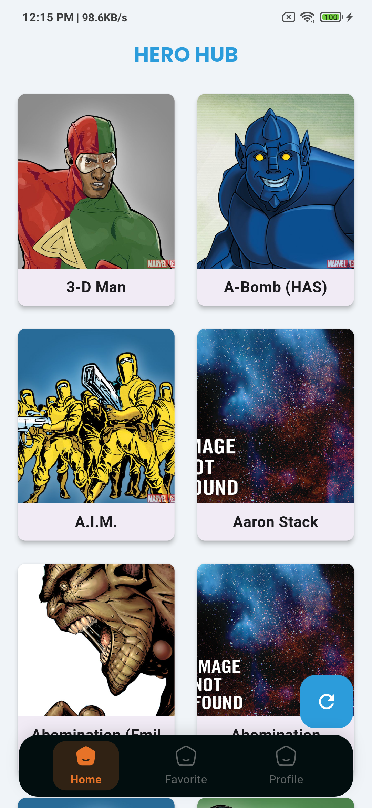
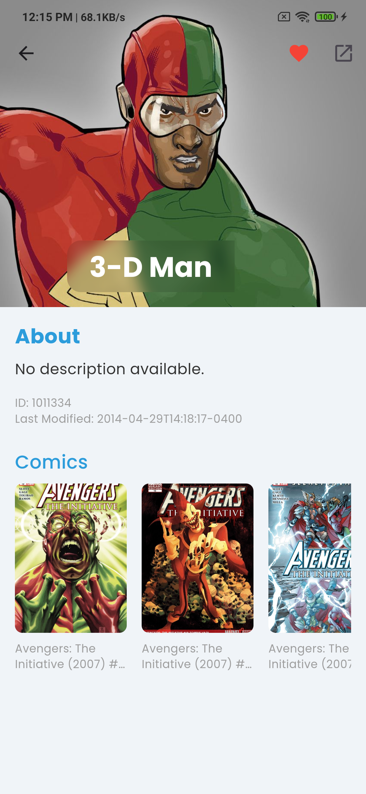
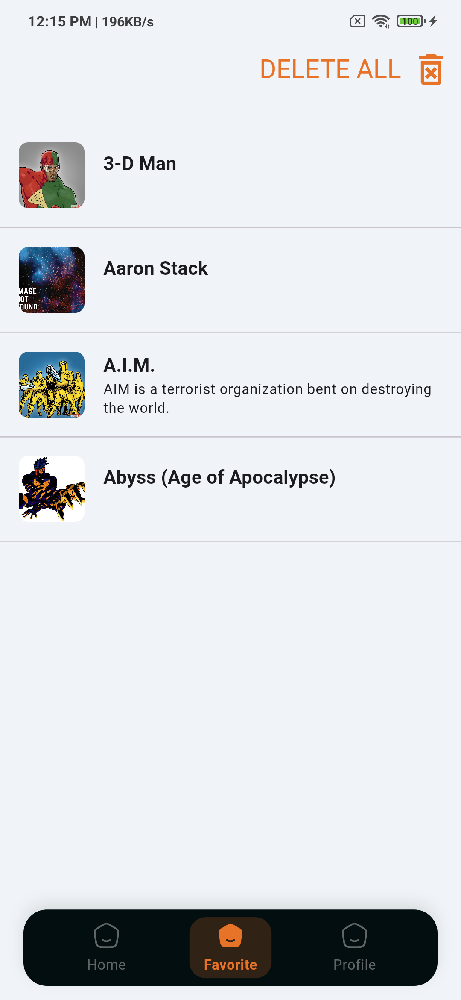

# Hero Hub

## Description

Marvel Hero Hub App is an interactive application that allows users to explore and discover Marvel characters. With features like detailed hero profiles and regular updates, users can dive deep into the Marvel universe.

## Features

- **Three Onboarding Screens**: Introduce users to the app's features.
- **Firebase Authentication**: Secure sign-in using email and password.
- **Home Screen**: Display a list of Marvel characters.
- **Detailed Hero Information**: Access comprehensive details about each Marvel character.
- **Regular Updates**: Stay updated with the latest Marvel news.

## Screenshots

Here are some screenshots of the Hero Hub app:

<p align="center">
  
  
  
  
  
</p>

## Installation

To run this app on your local machine, follow these steps:

1. **Clone the repository**:
   ```
   git clone https://github.com/nizarzitouni/Hero-Hub.git
   cd hero-hub
   ```

2. **Install dependencies**:
   ```
   flutter pub get
   ```

3. **Set up Firebase**:
   - Create a Firebase project.
   - Enable Firebase Authentication.
   - Download `google-services.json` (for Android) and `GoogleService-Info.plist` (for iOS) and place them in the appropriate directories.

4. **Get Marvel API Key**:
   - Register on the Marvel Developer Portal.
   - Obtain your API key.

5. **Configure API Key**:
   - Store your Marvel API key in your Flutter project (e.g., using environment variables or a secure configuration file).

6. **Run the app**:
   ```
   flutter run
   ```

## Usage

- **Onboarding**: Users are introduced to the app's features through three onboarding screens.
- **Authentication**: Users can sign in securely using Firebase Authentication.
- **Explore Heroes**: Users can browse through a list of Marvel heroes on the home screen.
- **Hero Details**: Users can click on a hero to view detailed information about them.
- **Updates**: Users can stay informed with the latest Marvel updates.

## Contributing

Contributions are welcome! Please fork this repository and submit a pull request for any enhancements or bug fixes.

## License

This project is licensed under the MIT License. See the LICENSE file for more information.
